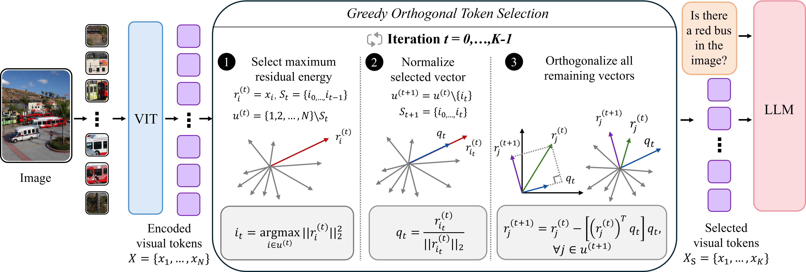
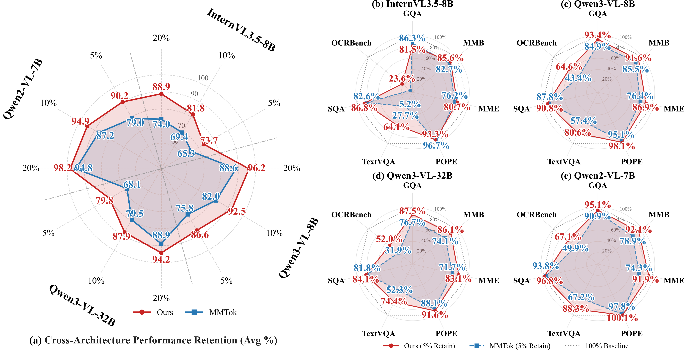

# GOTS: Greedy Orthogonal Token Selection for High-Resolution Vision-Language Models

Official PyTorch implementation of **GOTS** ([arXiv:2607.23913](https://arxiv.org/abs/2607.23913)).

> **TL;DR** GOTS is a training-free, query-agnostic visual-token reduction method for high-resolution VLMs. It greedily selects the token with the largest residual energy orthogonal to the already-retained span, which exactly maximizes the one-step Gram-determinant expansion. On Qwen2.5-VL-7B, GOTS retains **96.3% / 90.9% / 82.7%** of full-token performance at **20% / 10% / 5%** retention ratios, outperforming the strongest baseline (MMTok) by **5.8 / 8.6 / 11.1** percentage points.

---

## Overview

Modern high-resolution VLMs (e.g., Qwen-VL, InternVL) generate thousands of visual tokens per image, which causes quadratic self-attention cost and high prefill latency. GOTS compresses the visual sequence **before** it enters the LLM, using only vision-encoder features. It is **training-free** and **query-agnostic**, so no fine-tuning or text-prompt access is required.

This repository is built on top of the **[MMTok](https://github.com/Ironieser/MMTok)** framework: GOTS is implemented as an alternative `selector_type` backend alongside the original MMTok semantic coverage selector. The included `semantic` selector therefore reproduces the MMTok baseline, while `gots` enables the greedy orthogonal selection proposed in the paper.

### Method

Given $N$ vision-feature rows $X \in \mathbb{R}^{N \times d}$, GOTS selects a budget $K \ll N$ by:

1. Maintaining the residual component of each feature outside the span of already-selected tokens.
2. Greedy selection: at each step, pick the token with the maximum residual energy $\|r_i\|^2$.
3. Update all remaining residuals by orthogonal projection onto the new basis direction.

Proposition 1 in the paper shows that this rule is equivalent to applying QRCP on $X^\top$ and that it exactly maximizes the one-step augmented Gram determinant:

$$\det(X_{S\cup \lbrace j \rbrace} X_{S\cup \lbrace j \rbrace}^\top) = \det(X_S X_S^\top) \cdot e_j$$



---

## Installation

```bash
conda create -n mmtok python=3.12 -y
conda activate mmtok

# PyTorch 2.8.0 + CUDA 12.8 (see install.md for other CUDA versions)
pip install torch==2.8.0 torchvision==0.23.0 torchaudio==2.8.0 \
    --index-url https://download.pytorch.org/whl/cu128

pip install -r requirements.txt
pip install -e .
```

Optional: Flash Attention 2

```bash
pip install flash-attn --no-build-isolation
```

For detailed dependency setup, see [install.md](install.md).

---

## Quick Start

### Wrap Qwen2.5-VL with GOTS

```python
from transformers import Qwen2_5_VLForConditionalGeneration, AutoProcessor, AutoTokenizer
from mmtok.qwen.qwen2_5_vl_mmtok import mmtok_qwen2_5_vl

model = Qwen2_5_VLForConditionalGeneration.from_pretrained(
    "Qwen/Qwen2.5-VL-7B-Instruct",
    torch_dtype="auto",
    device_map="auto",
)
processor = AutoProcessor.from_pretrained("Qwen/Qwen2.5-VL-7B-Instruct")
tokenizer = AutoTokenizer.from_pretrained("Qwen/Qwen2.5-VL-7B-Instruct")

# Inject GOTS token selection
model, processor = mmtok_qwen2_5_vl(
    model,
    language_tokenizer=tokenizer,
    processor=processor,
    retain_ratio=0.2,      # keep 20% of vision tokens
    selector_type="gots",  # use GOTS; "semantic" selects the MMTok baseline
)

# Use the model as usual
messages = [
    {
        "role": "user",
        "content": [
            {"type": "image", "image": "example.jpg"},
            {"type": "text", "text": "What is in the image?"},
        ],
    }
]
text = processor.apply_chat_template(messages, tokenize=False, add_generation_prompt=True)
inputs = processor(images=None, text=text, return_tensors="pt").to(model.device)
outputs = model.generate(**inputs, max_new_tokens=128)
print(processor.batch_decode(outputs, skip_special_tokens=True))
```

You can also set the selector via environment variable:

```bash
export SELECTION_METHOD=gots   # or "semantic"
```

---

## Evaluation

We evaluate GOTS with [lmms-eval](https://github.com/EvolvingLMMs-Lab/lmms-eval). The `lmms-eval` directory is included in this repository.

```bash
# Run the full 11-benchmark suite on Qwen2.5-VL-7B
bash run_qwen2_5_vl_gots_eval.sh
```

which is equivalent to:

```bash
CUDA_VISIBLE_DEVICES=0 python -m lmms_eval \
  --model qwen2_5_vl_mmtok \
  --model_args pretrained=Qwen/Qwen2.5-VL-7B-Instruct,device=cuda,selector_type=gots,retain_ratio=0.2,min_pixels=1605632,max_pixels=1605632 \
  --tasks gqa,mme,pope,mmbench_en_dev,scienceqa,ocrbench,textvqa_val,chartqa,docvqa_val,realworldqa,mathvista_testmini \
  --batch_size 1
```

To integrate GOTS with another model in lmms-eval, wrap the model instance with the corresponding `mmtok_*` helper (see [install.md](install.md) Section 4).

---

## Main Results

Performance retention on **Qwen2.5-VL-7B-Instruct** under native dynamic resolution:

| Retention ratio | GOTS | MMTok (best baseline) |
|:---------------:|:----:|:---------------------:|
| 20% | **96.3%** | 90.5% |
| 10% | **90.9%** | 82.3% |
| 5%  | **82.7%** | 71.6% |

GOTS also transfers across **Qwen2-VL-7B**, **Qwen3-VL-8B**, **Qwen3-VL-32B**, and **InternVL3.5-8B**, with average-retention gains over MMTok widening under more aggressive compression.

### Cross-Architecture Generalization

The figure below compares GOTS (red) against the strongest baseline MMTok (blue) at **5% token retention** across five high-resolution VLMs. Each radar chart reports benchmark-wise performance retention; the outer dashed ring is the 100% full-token baseline.



At 5% retention, GOTS consistently improves average retention across all evaluated backbones, with margins of **8.4–11.7 percentage points** over MMTok:

| Backbone | GOTS (5%) | MMTok (5%) | Δ |
|----------|:---------:|:----------:|:-:|
| InternVL3.5-8B | 88.9 | 80.5 | **+8.4** |
| Qwen3-VL-8B | 92.5 | 81.7 | **+10.8** |
| Qwen2-VL-7B | 90.2 | 79.0 | **+11.2** |
| Qwen3-VL-32B | 94.2 | 82.5 | **+11.7** |

The largest gains appear on text-intensive tasks such as **OCRBench** and **TextVQA**, indicating that the selected-span complementarity principle is especially effective when aggressive compression must preserve fine-grained visual and textual evidence. Note that the left panel aggregates results across the model family; the right panels show per-model benchmark breakdowns (b–e). InternVL3.5-8B uses its native dynamic-tiling protocol; the Qwen backbones use controlled fixed-resolution inputs in this comparison.

### Efficiency

On OCRBench with Qwen2.5-VL-7B (fixed resolution, ~2,094 visual tokens/image):

| Metric | Full tokens | 5% GOTS |
|:-------|:-----------:|:-------:|
| Avg. vision tokens to LLM | 2,093.8 | 104.2 |
| LLM prefill latency | 170.95 ms | 24.87 ms (6.87× speedup) |
| Model-side TTFT | 433.16 ms | 295.10 ms (31.9% reduction) |

---

## Repository Structure

```
.
├── gots/                          # GOTS / MMTok core implementation
│   ├── core/
│   │   ├── gots_selector.py       # CUDA-graph-accelerated GOTS kernel
│   │   ├── semantic_selector.py   # Baseline semantic coverage selector
│   │   ├── mmtok_core.py          # MMTok wrapper and selection dispatch
│   │   └── text_processor.py      # Question keyword extraction
│   └── qwen/
│       ├── qwen2_5_vl_mmtok.py          # Qwen2.5-VL integration entry
│       ├── qwen2_5_VLmodel_mmtok.py     # Patched model.forward
│       └── modeling_qwen2_5_vl_mmtok.py # Patched vision forward
├── lmms-eval/                     # Evaluation framework (included)
├── install.md                     # Detailed installation guide
├── requirements.txt               # Python dependencies
├── run_qwen2_5_vl_gots_eval.sh   # 11-benchmark evaluation script
└── Figure/
    ├── method.png                 # Method overview figure
    └── result_model_family.png    # Cross-architecture performance retention
```

---

## Citation

If you find GOTS useful for your research, please consider citing:

```bibtex
@article{ling2026gots,
  title={GOTS: Greedy Orthogonal Token Selection for High-Resolution Vision-Language Models},
  author={Ling, Jun and Huang, Tao and Liu, Junzhuo and Tang, Bowen and Wang, Peng},
  journal={arXiv preprint arXiv:2607.23913},
  year={2026}
}
```

---

## Acknowledgements

This repository is built on top of the following projects:

- **[MMTok](https://github.com/Ironieser/MMTok)** – the visual-token reduction framework that provides the model hooks, semantic coverage selector, and evaluation integration used in this work.
- **[lmms-eval](https://github.com/EvolvingLMMs-Lab/lmms-eval)** – the evaluation framework for benchmarking high-resolution VLMs.
- The **Qwen-VL** and **InternVL** model families for the high-resolution vision-language backbones.
